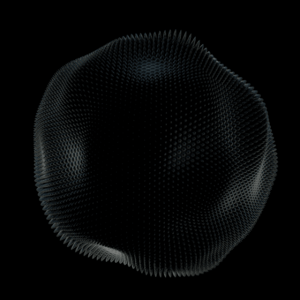

<h6 align="center">

<h6 align="center">

__________________________________________________________________________________________________
<h6 align="center"><b>🔗𝗖𝗢𝗡𝗡𝗘𝗖𝗧 𝗪𝗛𝗜𝗖𝗛 𝗠𝗘</b></h6>

<h6 align="center"
  

  

________________________________________________________________________________________________________________________________________________________________________

<h6 align="center"><b> 𝗔𝗕𝗢𝗨𝗧 𝗠𝗘 </b></h6>

  
  <h1>HI, I'M NAHYARA. </h1>
  
<i>Desenvolvedor Python em constante aprendizado</i>

###  SOBRE MIM 
- 𝗔𝘁𝘂𝗮𝗹𝗺𝗲𝗻𝘁𝗲 𝗲𝘀𝘁𝘂𝗱𝗮𝗻𝗱𝗼: **𝗜𝗻𝘁𝗲𝗹𝗶𝗴ê𝗻𝗰𝗶𝗮 𝗔𝗿𝘁𝗶𝗳𝗶𝗰𝗶𝗮𝗹 𝗲 𝗠𝗮𝗰𝗵𝗶𝗻𝗲 𝗟𝗲𝗮𝗿𝗻𝗶𝗻𝗴 𝗰𝗼𝗺 𝗣𝘆𝘁𝗵𝗼𝗻**
- 𝗘𝘀𝘁𝗼𝘂 𝗮𝗽𝗿𝗼𝗳𝘂𝗻𝗱𝗮𝗻𝗱𝗼 𝗺𝗲𝘂𝘀 𝗰𝗼𝗻𝗵𝗲𝗰𝗶𝗺𝗲𝗻𝘁𝗼𝘀 𝗲𝗺 **𝗣𝘆𝘁𝗵𝗼𝗻** 𝗲 **𝗖𝗼𝗻𝘁𝗿𝗼𝗹𝗲 𝗱𝗲 𝗩𝗲𝗿𝘀ã𝗼 𝗰𝗼𝗺 𝗚𝗶𝘁**.
- 𝗣𝗿𝗼𝗰𝘂𝗿𝗼 𝗰𝗼𝗹𝗮𝗯𝗼𝗿𝗮𝗿 𝗲𝗺 𝗽𝗿𝗼𝗷𝗲𝘁𝗼𝘀 𝗱𝗲 𝗰ó𝗱𝗶𝗴𝗼 𝗮𝗯𝗲𝗿𝘁𝗼 (𝗢𝗽𝗲𝗻 𝗦𝗼𝘂𝗿𝗰𝗲).
- 𝗢𝗯𝗷𝗲𝘁𝗶𝘃𝗼 𝗽𝗮𝗿𝗮 𝟮𝟬𝟮𝟲: 𝗗𝗼𝗺𝗶𝗻𝗮𝗿 𝗶𝗻𝘁𝗲𝗴𝗿𝗮çã𝗼 𝗱𝗲 𝗔𝗣𝗜𝘀 𝗲 𝗹ó𝗴𝗶𝗰𝗮 𝗮𝘃𝗮𝗻ç𝗮𝗱𝗮.
- 𝗖𝘂𝗿𝗶𝗼𝘀𝗶𝗱𝗮𝗱𝗲: 𝗔𝗱𝗼𝗿𝗼 𝗿𝗲𝘀𝗼𝗹𝘃𝗲𝗿 𝗽𝗿𝗼𝗯𝗹𝗲𝗺𝗮𝘀 𝗱𝗼 𝗱𝗶𝗮 𝗮 𝗱𝗶𝗮 𝘂𝘀𝗮𝗻𝗱𝗼 𝗮𝘂𝘁𝗼𝗺𝗮çã𝗼.

_____________________________________________________________________________________________________________________________________________________________________________

  <i>"A simplicidade é o último grau de sofisticação."</i>  
  — <b>Leonardo da Vinci</b>

  

<h6 align="center"><b> 𝗧𝗘𝗖𝗛𝗡𝗢𝗟𝗢𝗚𝗜𝗘𝗦 𝗔𝗡𝗗 𝗧𝗢𝗢𝗟𝗦 </b></h6> 
<h6 align="center"><b> Here are the tools I use in my day-to-day work: </b></h6>

<h6 align="center">
  
 
  

---

<h2 align="center">GITHUB STATISTICS</h2>

--

<h2 align="center">🌍 LANGUAGE / IDIOMAS </h2> 

* 🇪🇸 **Espanhol:** Avançado (C1)
* 🇺🇸 **Inglês:** Intermediário (B1)
* 🇫🇷 **Francês:** Básico (A2)
* 🇮🇹 **Italiano:** Iniciante (A1)

<h2 align="center">

___________________________________________________________________________________________________________________________________________________________________

### 📫 Como me encontrar
- **LinkedIn:** [Clique aqui para meu perfil](https://linkedin.com)
- **E-mail:** [seu-email@h.com](mailto:seu-email@h.com)
- **Portfólio:** [Link do seu site ou repositórios principais]

---

  <i>"O código é como humor. Quando você tem que explicar, é ruim." – Cory House</i>

Build a real-time streaming data chart using the HTML Canvas API. No libraries, no CDN scripts — zero dependencies.

VISUAL DESIGN
- Dark background (#0a0a0a) with a subtle dot-grid overlay (1px dots at 40px spacing, rgba(255,255,255,0.03))
- Three data series as smooth cubic bezier curves:
  1. CPU Load — cyan (#00c4ff), range 0–100%
  2. Memory Usage — emerald (#00ff88), range 0–16 GB
  3. Response Time — violet (#a855f7), range 0–500 ms
- Semi-transparent gradient fill beneath each line, fading from 20% opacity at the line to transparent at the chart floor
- Soft glow on each line using canvas shadowBlur (8px, line color at 40% opacity)
- 2px line width with round lineCap and lineJoin
- Render at window.devicePixelRatio for crisp Retina/HiDPI output

CHART LAYOUT
- Rolling 60-second time window with data scrolling right to left
- Y-axis on the left with 5 horizontal gridlines (dashed 1px, rgba(255,255,255,0.06))
- X-axis along the bottom with time labels at 15-second intervals: "-60s", "-45s", "-30s", "-15s", "now"
- Padding: 60px left, 30px bottom, 20px right, 12px top

LEGEND
- Anchored top-right inside the chart area
- Each entry: 6px colored circle + series name + current live value with unit
- Background: rgba(0,0,0,0.7), border-radius 8px, 1px border at rgba(255,255,255,0.1)
- Font: 11px system-ui, color rgba(255,255,255,0.7)

CROSSHAIR & TOOLTIP
- On mousemove: draw a vertical dashed line from top to bottom of the chart area
- Show a tooltip card near the cursor with the timestamp and interpolated values for all three series
- Each value row has a small colored dot matching its series
- Card style: dark background, 8px border-radius, subtle border, drop shadow
- Hide everything on mouseleave

DATA SIMULATION
- Generate a new data point every 500ms
- CPU: slow sine wave (~30s period) centered around 40–60% plus ±10% random noise
- Memory: gradual random walk between 4–12 GB with momentum (velocity damped at 0.95)
- Latency: stable ~80ms baseline with ~3% chance per tick of a spike to 200–400ms
- Smooth cubic interpolation between points for fluid motion

TECHNICAL REQUIREMENTS
- Use requestAnimationFrame for the render loop (target 60fps)
- Use ResizeObserver to resize the canvas when its container changes size
- Fixed-size data array — drop oldest points that exceed the 60-second window
- Layered render passes: background → grid → gradient fills → lines → legend → crosshair/tooltip
- Click the chart to pause/resume the data stream
- Expose a destroy() method that cancels animation and disconnects observers

OUTPUT
- Single HTML file with embedded <style> and <script>
- Chart fills its container: width 100%, height 400px default, min-height 250px
- Production-grade aesthetic — should feel like a professional observability dashboard panel

